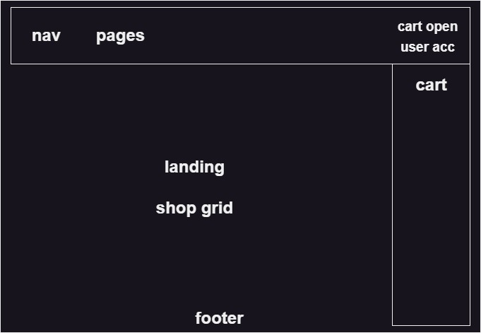
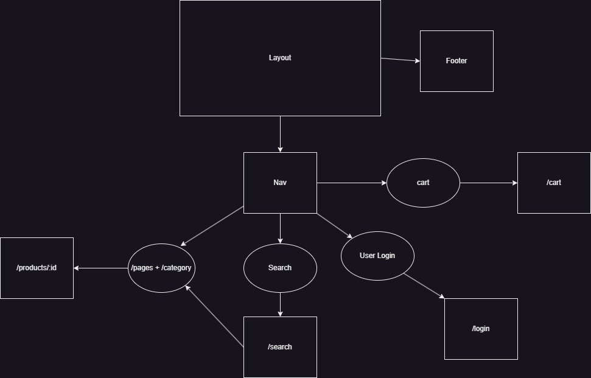

# Next Js E-Commerce App

This is a [Next.js](https://nextjs.org/) project bootstrapped with [`create-next-app`](https://github.com/vercel/next.js/tree/canary/packages/create-next-app).

### Capstone Project

Name of Student: Sam Adams

Name of Project: Keyboard E-Commerce

Project's Purpose or Goal: A Keyboard E-Commerce Store where users can add things to cart and checkout using Stripe

List the absolute minimum features the project requires to meet this purpose or goal:

- Multi-page App with Landing, Categories, Cart, Checkout and Dynamic Routes
- Items and Prices stored in Stripes API
- Checkout Handled through Stripe

What tools, frameworks, libraries, APIs, modules and/or other resources (whatever is specific to your track, and your language) will you use to create this MVP? List them all here. Be specific.

- Next.js
- Stripe
- TailwindCSS
- DaisyUI

If you finish developing the minimum viable product (MVP) with time to spare, what will you work on next? Describe these features here: Be specific.

Mobile App
User Items, Login with Auth0
TypeScript Refactor

What additional tools, frameworks, libraries, APIs, or other resources will these additional features require?

- Auth0
- TypeScript
- React Native / Flutter
- SupaBase

Is there anything else you'd like your instructor to know?

## Friday, July 7th

- 8:30: initialize app + readme
- 9:10: [stripe research](https://stripe.com/docs/payments/quickstart?client=next&platform=web)
- 9:40: Commerce research
- 10:10: Layouts planning
- 11:00: Footer Start / still figuring out next js
- 12:00: Nav Bar Start
- 1:15: Nav bar fix / need to figure out state in next js
- 2:00: client component sidebar test
- 2:30: Working Sidebar + color changes
- 3:00: Nav and Cart Changes
- 3:30: next js research
- 4:00: learning about server components
- 4:30: Started ItemDisplay.js
- 5:00: Types of Items Routes in Nav Bar

## Monday, July 10th

- 6:00 Nav bar mobile and Routes // Needs Refactor

## Friday, July 14th

- 8:00: Plan to Research Backend stuff, Refactor Nav, Page Links, Page Layout and render, 404 page
- 8:30: Paths and Nav Refactor
- 9:00: NextJs research + Sidebar Fix and layout refactor
- 9:30: Initial Landing page
- 10:30: Item Card Initial, Trying to get Landing page carousel
- 11:10: Item Card Styling, Hard Coded Json for products for now later backend
- 11:30: updated json, permalink and thumbnail
- 12:00: nav bar dropdown always on top, experimenting with out of stock banner, page header
- 1:30: Dynamic Product page start, need to research
- 2:10: Stripe Setup // Working GET products
- 2:40: Displaying Correct Information Need to fix prices
- 3:10: Displaying Correct Prices formatted
- 3:30: nextjs research
- 4:00: still trying to figure out dynamic routes
- 4:20: renders dynamic item on page, Not sure if api call every time link is pressed is best practice
- 5:00: Simple product page layout AND deployment

## Friday, July 21th

- 8:00 Plan for Today: Research Stripe, Search and Cart Feature
- 9:00 Fixed Env, Research Stripe
- 10:00 Products with type and Description, Dynamic Link refactor, Sort Item by type
- 10:30 Research
- 11:15 First Attempt at Add to cart, Cart adds items to array but resets on refresh
- 12:00 Add to Cart works and is stored in local storage (use accounts later)
- 1:30 Working Cart View Needs big refactor, I need to make less Api calls
- 2:00 After Trying different ways to make less api calls I read [This](https://nextjs.org/docs/app/building-your-application/data-fetching#automatic-fetch-request-deduping)
- 2:30 Refactor
- 3:45 Finally Working Quantities
- 4:15 Stripe Payment Research
- 4:40 Stripe Attempts Still don't work
- 5:00 Vercel Deploy

## Monday, July 24th

- 4:00 Product Images, Footer Refactor Still Needs Work, Overall Viewing Changes
- 6:00 nav tip bar in products and

## Tuesday, July 25th

- 1:00 Finally got database connected to auth, Tried Auth0, NextAuth Worked, Tried SupaBase but it was deprecated, Then I used prisma to connect to Neon.
- 2:45 User session is logged in db and displays correct nav info

- todo: search and account page, about + contact

## Wednesday, July 26th

- 3:00 Attempt at Prisma Post to Emails table failed for Newsletter.
- 5:00 Working Search Logic.

## Layouts

# Resources used

[DaisyUI](https://daisyui.com)
[Icons](https://heroicons.com)
[Images](https://geekhack.org/index.php?PHPSESSID=7b6pvfn29cprc0naa9uodr81hbc8vj68&board=132.0)
